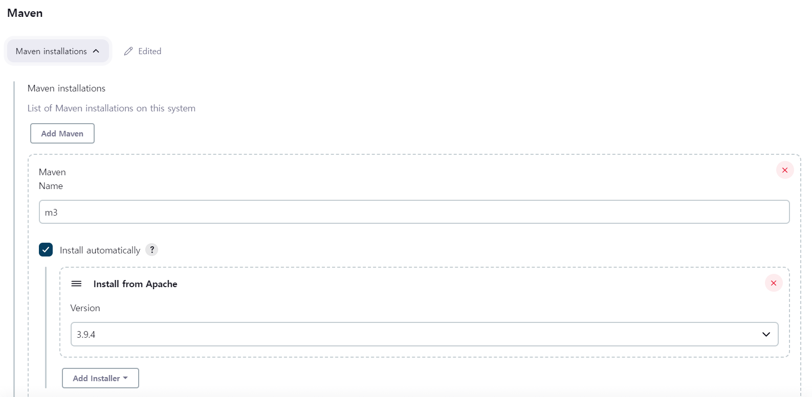
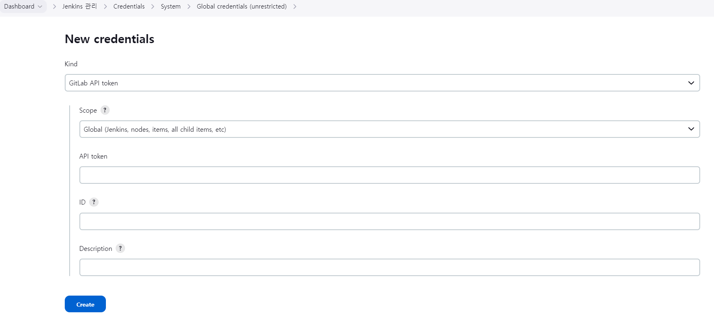
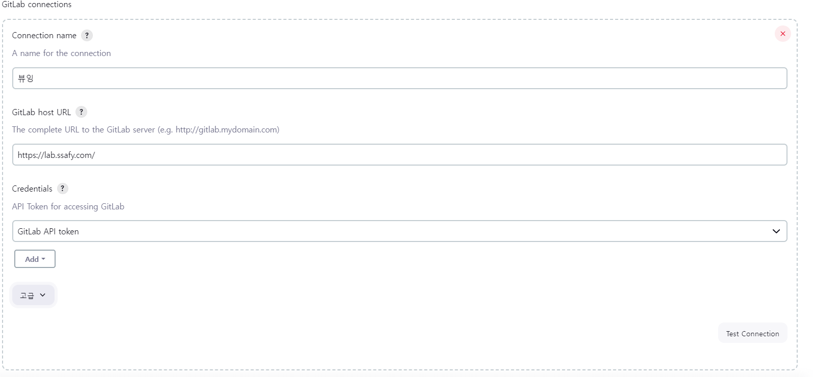

# 빌드 및 배포

## 패키지 설치

### apt-get 업데이트

```
sudo apt-get update
```

---

### Jenkins 설치

#### 젠킨스를 위한 JAVA 설치

```
apt-get install openjdk-11-jdk
```

#### Jenkins APT 저장소 사용 / GPG 키 가져오기

```
wget -q -O - https://pkg.jenkins.io/debian/jenkins.io.key | sudo apt-key add -
```

#### Jenkins 리포지토리 시스템 추가

```
sudo sh -c 'echo deb http://pkg.jenkins.io/debian-stable binary/ > /etc/apt/sources.list.d/jenkins.list'
```

#### Jenkins 최신 버전 설치

```
sudo apt-get install jenkins
```

- 오류가 발생합니다 오류 메시지에 나온 public key가 이후 과정에 필요합니다.

#### Public Key로 Jenkins Apt저장소의 공개키 등록

```
sudo apt-key adv --keyserver keyserver.ubuntu.com --recv-keys
```

- 이 키는 패키지의 무결성과 출처를 확인하는데 사용합니다.
- 위 과정이 완료된다면 젠킨스는 8080포트에서 자동으로 실행됩니다.

```
sudo systemctl status jenkins
```

---

### 도커 설치

#### 패키지 설치

```
sudo apt-get install apt-transport-https ca-certificates curl gnupg-agent software-properties-common
```

#### Docker의 GPG키 가져오기

```
curl -fsSL https://download.docker.com/linux/ubuntu/gpg | sudo apt-key add -
```

#### Docker Apt 저장소 사용

```
sudo add-apt-repository "deb [arch=amd64] https://download.docker.com/linux/ubuntu $(lsb_release -cs) stable"
```

#### 시스템 패키지 업데이트

```
sudo apt-get update
```

#### Docker 설치

```
sudo apt-get install docker-ce docker-ce-cli containerd.io
```

#### Docker 설치 환경 확인

```
sudo systemctl status docker
```

---

### PostgreSql 설치

- 도커 컨테이너로 PostgreSql을 배포했습니다.

#### 도커로 컨테이너 생성

```
docker run -p 5432:5432 --name 컨테이너이름 \
-e TZ=Asia/Seoul \
-v /임의의경로:/var/lib/postgresql/data \
-d postgres:15.3
```

- -v 옵션은 공유볼륨 사용

---

### Redis 설치

- 호스트 환경에 Redis를 배포했습니다.

#### Redis 패키지 설치

```
sudo apt-get install redis-server
```

#### Redis 암호 설정

- Host환경에서 노출된 포트에 배포할것이므로 암호를 설정해야합니다.

```
sudo nano /etc/redis/redis.conf
```

- requirepass=암호

```
sudo systemctl restart redis-server.service
```

- 환경설정 적용을 위해 재시작

---

## OpenVidu 설치

#### OpenVidu 패키지 설치

```
cd /opt
sudo curl https://s3-eu-west-1.amazonaws.com/aws.openvidu.io/install_openvidu_latest.sh | bash

```

#### OpenVidu 설정 및 LetsEncrypt를 통한 인증서 발급

- 프론트엔드와 백엔드 서버 포트 확보를 위해 OPENVIDU HTTP/HTTPS 포트를 각각 8082, 8083에 배치했습니다.

```
cd openvidu
vi .env

DOMAIN_OR_PUBLIC_IP=도메인
OPENVIDU_SECRET=비밀번호
CERTIFICATE_TYPE=letsencrypt
LETSENCRYPT_EMAIL=your@email.com

HTTP_PORT=8082
HTTPS_PORT=8083

./openvidu start
```

#### OpenVidu Nginx 설정

- OpenVidu에서는 자체적으로 Nginx를 사용하고 Docker-Compose를 통한 빌드시 Openvidu-proxy-server라는 Nginx 컨테이너를 생성합니다. 따라서 OpenVidu가 사용하는 Nginx의 설정을 변경했습니다.

#### Nginx Jenkins

- 젠킨스는 도커 컨테이너에 로컬 8699포트로 매핑했습니다.
- Nginx에서 HTTPS가 적용된 외부 8700포트의 요청을 전달합니다.

```
nano /opt/openvidu/custom-nginx-vhosts/jenkins.conf

server {
        listen 8700 ssl;
        server_name i9a205.p.ssafy.io;


        # SSL Config
        ssl_certificate         /etc/letsencrypt/live/i9a205.p.ssafy.io/fullchain.pem;
        ssl_certificate_key     /etc/letsencrypt/live/i9a205.p.ssafy.io/privkey.pem;
        ssl_trusted_certificate /etc/letsencrypt/live/i9a205.p.ssafy.io/fullchain.pem;

        location / {
                proxy_pass http://localhost:8699;
        }
}
```

---

#### Nginx FrontEnd

- 프론트엔드 서버는 도커 컨테이너에 로컬 3002포트로 매핑했습니다.
- Nginx에서 HTTPS가 적용된 외부 443포트의 요청을 전달합니다.

```
nano /opt/openvidu/custom-nginx-vhosts/viewingReact.conf

server {
        listen 443 ssl;
        server_name i9a205.p.ssafy.io;


        # SSL Config
        ssl_certificate         /etc/letsencrypt/live/i9a205.p.ssafy.io/fullchain.pem;
        ssl_certificate_key     /etc/letsencrypt/live/i9a205.p.ssafy.io/privkey.pem;
        ssl_trusted_certificate /etc/letsencrypt/live/i9a205.p.ssafy.io/fullchain.pem;

        location / {
                proxy_pass http://localhost:3002;
        }

        location /ws {

                proxy_http_version 1.1;

                proxy_set_header Connection "upgrade";

                proxy_set_header Upgrade $http_upgrade;

                proxy_pass http://localhost:3002;

                proxy_set_header Host $host;
        }
}

```

---

#### Nginx BackEnd

- 프론트엔드 서버는 도커 컨테이너에 로컬 8090포트로 매핑했습니다.
- Nginx에서 HTTPS가 적용된 외부 8080포트의 요청을 전달합니다.

```
nano /opt/openvidu/custom-nginx-vhosts/viewingSpring.conf

server {
        listen 8080 ssl;
        server_name i9a205.p.ssafy.io;


        # SSL Config
        ssl_certificate         /etc/letsencrypt/live/i9a205.p.ssafy.io/fullchain.pem;
        ssl_certificate_key     /etc/letsencrypt/live/i9a205.p.ssafy.io/privkey.pem;
        ssl_trusted_certificate /etc/letsencrypt/live/i9a205.p.ssafy.io/fullchain.pem;

        location / {
                proxy_pass http://localhost:8090;
        }

        location ~ ^/members(/.*/)?notification$ {
                proxy_http_version 1.1;
                proxy_set_header Connection '';
                proxy_set_header X-Accel-Buffering 'no';
                chunked_transfer_encoding on;
                proxy_buffering off;
                proxy_pass http://localhost:8090;
                proxy_set_header Cache-Control 'no-cache';
                proxy_read_timeout 86400s;
        }

        location /studyChat {

                proxy_http_version 1.1;

                proxy_set_header Connection "upgrade";

                proxy_set_header Upgrade $http_upgrade;

                proxy_pass http://localhost:8090;
        }

        location /ws {

                proxy_http_version 1.1;

                proxy_set_header Connection "upgrade";

                proxy_set_header Upgrade $http_upgrade;

                proxy_pass http://localhost:8090;
        }

}

```

---

## Jenkins 초기 환경 구성

### Tools 설정

- 저희 프로젝트는 기본적으로 Maven기반의 프로젝트입니다.



- 젠킨스에서 공통으로 사용할 maven 입니다.
- 저희 프로젝트에서는 이후 파이프라인에서 사용합니다.

### Plugin 다운로드

- Jenkins에서는 다양한 플러그인을 통해 기능과 편의를 제공합니다.
- 저희가 설치한 플러그인들을 다음과 같습니다.
  - Docker API Plugin
  - Generic Webhook Trigger Plugin
  - Git Parameter Plugin
  - Git Plugin
  - Git Server Plugin
  - GitLab Branch Source Plugin
  - Gitlab Merge Request Builder
  - Gitlab Plugin
  - Global Slack Notifier Plugin

### GitLab과의 연결

#### Gitlab Access Token 생성

- Gitlab은 외부에서 프로젝트에 접근할때 Access Token을 요구합니다.

- Settings의 Access Token에서 Project에 접근할 수 있는 Access Token을 발급합니다.

#### Jenkins Credential에 등록

- Gitlab Access Token을 발급받았다면 이를 Jenkins에 등록해야합니다. Jenkins Global Credentials에 등록하면 Jenkins내에서 사용할 수 있습니다
  

#### Jenkins Gitlab 연결 설정

- 저희 프로젝트는 개발과정에서 GitLab을 사용했습니다.
- Gitlab 저장소에 있는 프로젝트를 빌드하기에 연결은 필수입니다.
  
- Test Connection을 통해 연결을 확인 할 수 있습니다.

- 위 과정에서 Jenkins와 Gitlab의 프로젝트에 연결했습니다.

## Jenkisn PipeLine 구성

### Jenkins 환경 변수 설정

- Jenkins에서는 자체적으로 환경변수를 지원합니다. DB계정,암호,S3계정과 같은 민감한 정보들을 환경변수로 사용하여 원격 저장소에 노출시키지 않을 수 있습니다.
- 저희 프로젝트에서는 파이프라인을 사용하여 빌드시에 젠킨스 환경변수를 배포 환경에 주입할 예정입니다.
- Jenkins System의 환경변수에서 추가 가능합니다.
  

- 저희는 스프링부트 프로젝트의 application.properties를 전부 Jenkins 환경변수로 등록했습니다

- 해당 목록은 Jenkins환경변수목록.md에 있습니다.

### Jenkins 파이프라인 구성

#### Gitlab Webhook 설정

- Gitlab에서의 발생하는 이벤트들은 Jenkins에서 확인할 필요가 있습니다. 이를 지원하는게 WebHook입니다.
  Gitlab에서의 Webhook을 통해 특정 이벤트를 발생시키면 Jenkins의 작업이 유도됩니다.
- 저희 프로젝트에서는 WebHook을 통해 release/FE,release/BE 같은 배포 브랜치에 변경이 발생할경우
  해당 브랜치를 빌드하게 했습니다.

#### 백엔드 파이프라인

- 선언적 파이프라인을 사용하여 파이프라인을 구성했습니다.
- 먼저 Build가 시작될때 Slack 특정 채널에 이를 알리고
- Jenkins Workspace에 해당 브랜치의 소스를 Clone합니다.
- 이후 Maven을 통해 빌드합니다.
- 빌드가 완료된 JAR파일을 다른 폴더로 옮기고
- JAR파일과 DockerFile을 통해 도커 이미지를 만듭니다. 이미지를 만드는 과정에서 환경변수를 주입합니다.
- 이미지를 Private Repository로 푸쉬합니다. (공용 Repository는 저희가 쓰는 환경변수가 노출될 수 있습니다)
- 이 후 Private Repository에 있는 이미지를 실행합니다.
- 위 과정에서 JAR파일을 통해 환경변수를 주입해 이미지를 만드는 것보다 이미지를 실행할때 환경변수를 주입하는 것이 나을것 같습니다.
- 이후 결과에 따라 SLACK에 알림을 보냅니다.

```
pipeline {
    agent any

    tools {
        // Install the Maven version configured as "M3" and add it to the path.
        maven "m3"
    }

    stages {
        stage("Set Variable") {
            steps {
                script {
                    JENKINS_ITEM_NAME = "ViewingSpring"
                    JAR_FILE = "InterviewStudy-0.0.1-SNAPSHOT.jar"
                    BRANCH = "release/be"
                    SSH_CONNECTION = "ubuntu@i9a205.p.ssafy.io"
                    SSH_CONNECTION_CREDENTIAL = "aws_key"
                }
            }
        }
        stage('Build Start'){
            steps{
                slackSend (
                    channel: '#빌드',
                    color: '#0000FF',
                    message: """빌드시작합니다! 브랜치 [$BRANCH] 젠킨스 빌드정보 ${env.JOB_NAME} [${env.BUILD_NUMBER}]"""
                )
            }
        }
        stage('Git Clone') {

            steps {

                // Get some code from a GitHub repository
                git branch: 'release/be', url: 'https://lab.ssafy.com/s09-webmobile1-sub2/S09P12A205.git', credentialsId: 'jenkins_gitlab'
            }
        }
        stage('Maven Build') {
            steps {
                dir('./back'){
                    sh "mvn -Dmaven.test.failure.ignore=true clean package"
                }
            }
        }
        stage('Move Jar File To dockerfile directory') {
            steps {
                sh "mv /var/lib/jenkins/workspace/${JENKINS_ITEM_NAME}/back/target/${JAR_FILE} /var/lib/jenkins/workspace/${JENKINS_ITEM_NAME}/back/docker/${JAR_FILE}"
            }
        }
        stage('Docker Image Build') {
            steps {
                dir("./back/docker") {
                    sh "docker build -t viewing:0.0 \
                    --build-arg spring_datasource_driver_class_name=${env.spring_datasource_driver_class_name} \
                    --build-arg spring_datasource_password=${env.spring_datasource_password} \
                    --build-arg spring_datasource_url=${env.spring_datasource_url} \
                    --build-arg spring_datasource_username=${env.spring_datasource_username} \
                    --build-arg spring_jpa_hibernate_ddl_auto=${env.spring_jpa_hibernate_ddl_auto} \
                    --build-arg spring_jpa_properties_hibernate_dialect=${env.spring_jpa_properties_hibernate_dialect} \
                    --build-arg spring_jpa_properties_hibernate_format_sql=${env.spring_jpa_properties_hibernate_format_sql} \
                    --build-arg spring_jpa_show_sql=${env.spring_jpa_show_sql} \
                    --build-arg spring_redis_host=${env.spring_redis_host} \
                    --build-arg spring_redis_lettuce_pool_max_active=${env.spring_redis_lettuce_pool_max_active} \
                    --build-arg spring_redis_lettuce_pool_max_idle=${env.spring_redis_lettuce_pool_max_idle} \
                    --build-arg spring_redis_lettuce_pool_min_idle=${env.spring_redis_lettuce_pool_min_idle} \
                    --build-arg spring_redis_port=${env.spring_redis_port} \
                    --build-arg OPENVIDU_URL=${env.OPENVIDU_URL} \
                    --build-arg OPENVIDU_SECRET=${env.OPENVIDU_SECRET} \
                    --build-arg cloud_aws_s3_bucket=${env.cloud_aws_s3_bucket} \
                    --build-arg cloud_aws_region_static=${env.cloud_aws_region_static} \
                    --build-arg cloud_aws_stack_auto=${env.cloud_aws_stack_auto} \
                    --build-arg cloud_aws_credentials_access_key=${env.cloud_aws_credentials_access_key} \
                    --build-arg cloud_aws_credentials_secret_key=${env.cloud_aws_credentials_secret_key} \
                    --build-arg spring_servlet_multipart_max_file_size=${env.spring_servlet_multipart_max_file_size} \
                    --build-arg spring_servlet_multipart_max_request_size=${env.spring_servlet_multipart_max_request_size} \
                    --build-arg spring_servlet_multipart_enabled=${env.spring_servlet_multipart_enabled} \
                    --build-arg spring_datasource_hikari_maximum_pool_size=${env.spring_datasource_hikari_maximum_pool_size} \
                    --build-arg oauth_redirecturi=${env.oauth_redirecturi} \
                    . "
                }
            }
        }

        stage('Docker Image Push') {
            steps {
                sh '''
                docker tag viewing:0.0 localhost:9000/viewing:0.0
                docker push localhost:9000/viewing:0.0
                '''
            }
        }
        stage('Deploy') {
            steps {
                    sh "docker rm -f viewing-spring-app"
                    sh "docker rmi -f localhost:9000/viewing:0.0"
                    sh "docker pull localhost:9000/viewing:0.0"
                    sh "docker run -d \
                           -p 8090:8080 \
                           -m 1200m \
                           --cpus=2 \
                           -e SPRING_JPA_OPEN_IN_VIEW=false \
                           -e SPRING_REDIS_PASSWORD=sonheungminbongjunhokimnamjinletsgo \
                           -e SPRING_REDIS_HOST=i9a205.p.ssafy.io \
                           -e USER_TIMEZONE=Asia/Seoul \
                           --name viewing-spring-app \
                           -v /home/ubuntu/springlog:/viewing \
                           localhost:9000/viewing:0.0"

            }
        }
    }
    post {
        success {
            slackSend (
                channel: '#빌드',
                color: '#00FF00',
                message: """
                            빌드성공! 브랜치 [$BRANCH] 젠킨스 빌드정보 ${env.JOB_NAME} [${env.BUILD_NUMBER}]
                            [DEPLOY URL: http://i9a205.p.ssafy.io:8080]
                        """
                )
        }
        failure {
         slackSend (
                channel: '#빌드',
                color: '#FF0000',
                message: """빌드실패.. 브랜치 [$BRANCH] 젠킨스 빌드정보 ${env.JOB_NAME} [${env.BUILD_NUMBER}]
                        [DEPLOY URL: http://i9a205.p.ssafy.io:8080]"""
            )
        }
    }
}
```

- 위 파이프라인에서 사용한 도커 파일입니다.

```
FROM openjdk:11-jre-slim

ARG JAR_FILE=InterviewStudy-0.0.1-SNAPSHOT.jar

ENV SPRING_DATASOURCE_DRIVER_CLASS_NAME=${spring_datasource_driver_class_name}

ARG spring_datasource_driver_class_name

ENV SPRING_DATASOURCE_DRIVER_CLASS_NAME=${spring_datasource_driver_class_name}

ARG spring_datasource_password

ENV SPRING_DATASOURCE_PASSWORD=${spring_datasource_password}

ARG spring_datasource_url

ENV SPRING_DATASOURCE_URL=${spring_datasource_url}

ARG spring_datasource_username

ENV SPRING_DATASOURCE_USERNAME=${spring_datasource_username}

ARG spring_jpa_hibernate_ddl_auto

ENV SPRING_JPA_HIBERNATE_DDL_AUTO=${spring_jpa_hibernate_ddl_auto}

ARG spring_jpa_properties_hibernate_dialect

ENV SPRING_JPA_PROPERTIES_HIBERNATE_DIALECT=${spring_jpa_properties_hibernate_dialect}

ARG spring_jpa_properties_hibernate_format_sql

ENV SPRING_JPA_PROPERTIES_HIBERNATE_FORMAT_SQL=${spring_jpa_properties_hibernate_format_sql}

ARG spring_jpa_show_sql

ENV SPRING_JPA_SHOW_SQL=${spring_jpa_show_sql}

ARG spring_redis_host

ENV SPRING_REDIS_HOST=${spring_redis_host}

ARG spring_redis_lettuce_pool_max_active

ENV SPRING_REDIS_LETTUCE_POOL_MAX_ACTIVE=${spring_redis_lettuce_pool_max_active}

ARG spring_redis_lettuce_pool_max_idle

ENV SPRING_REDIS_LETTUCE_POOL_MAX_IDLE=${spring_redis_lettuce_pool_max_idle}

ARG spring_redis_lettuce_pool_min_idle

ENV SPRING_REDIS_LETTUCE_POOL_MIN_IDLE=${spring_redis_lettuce_pool_min_idle}

ARG spring_redis_port

ENV SPRING_REDIS_PORT=${spring_redis_port}

ARG OPENVIDU_URL

ENV OPENVIDUURL=${OPENVIDU_URL}

ARG OPENVIDU_SECRET

ENV OPENVIDUSECRET=${OPENVIDU_SECRET}

ARG cloud_aws_s3_bucket

ENV cloud_aws_s3_bucket=${cloud_aws_s3_bucket}

ARG cloud_aws_region_static

ENV cloud_aws_region_static=${cloud_aws_region_static}

ARG cloud_aws_stack_auto

ENV cloud_aws_stack_auto=${cloud_aws_stack_auto}

ARG cloud_aws_credentials_access_key

ENV cloud_aws_credentials_access_key=${cloud_aws_credentials_access_key}

ARG cloud_aws_credentials_secret_key

ENV cloud_aws_credentials_secret_key=${cloud_aws_credentials_secret_key}

ARG spring_servlet_multipart_max_file_size

ENV spring_servlet_multipart_max_file_size=${spring_servlet_multipart_max_file_size}

ARG spring_servlet_multipart_max_request_size

ENV spring_servlet_multipart_max_request_size=${spring_servlet_multipart_max_request_size}

ARG spring_servlet_multipart_enabled

ENV spring_servlet_multipart_enabled=${spring_servlet_multipart_enabled}

ARG cloud_aws_s3_bucket

ENV cloud_aws_s3_bucket=${cloud_aws_s3_bucket}

ARG cloud_aws_region_static

ENV cloud_aws_region_static=${cloud_aws_region_static}

ARG cloud_aws_stack_auto

ENV cloud_aws_stack_auto=${cloud_aws_stack_auto}

ARG cloud_aws_credentials_access_key

ENV cloud_aws_credentials_access_key=${cloud_aws_credentials_access_key}

ARG cloud_aws_credentials_secret_key

ENV cloud_aws_credentials_secret_key=${cloud_aws_credentials_secret_key}

ARG spring_servlet_multipart_max_file_size

ENV spring_servlet_multipart_max_file_size=${spring_servlet_multipart_max_file_size}

ARG spring_servlet_multipart_max_request_size

ENV spring_servlet_multipart_max_request_size=${spring_servlet_multipart_max_request_size}

ARG spring_servlet_multipart_enabled

ENV spring_servlet_multipart_enabled=${spring_servlet_multipart_enabled}

ARG spring_datasource_hikari_maximum_pool_size

ENV SPRING_DATASOURCE_HIKARI_MAXIMUM_POOL_SIZE=${spring_datasource_hikari_maximum_pool_size}

ARG oauth_redirecturi

ENV OAUTH_REDIRECTURI=${oauth_redirecturi}

COPY ${JAR_FILE} app.jar

EXPOSE 8090

RUN mkdir -p viewing

CMD java -Dspring.datasource.driver-class-name=${SPRING_DATASOURCE_DRIVER_CLASS_NAME} \
 -Dspring.datasource.password=${SPRING_DATASOURCE_PASSWORD} \
 -Dspring.datasource.url=${SPRING_DATASOURCE_URL} \
 -Dspring.datasource.username=${SPRING_DATASOURCE_USERNAME} \
 -Dspring.jpa.hibernate.ddl-auto=${SPRING_JPA_HIBERNATE_DDL_AUTO} \
 -Dspring.jpa.properties.hibernate.dialect=${SPRING_JPA_PROPERTIES_HIBERNATE_DIALECT} \
 -Dspring.jpa.show-sql=${SPRING_JPA_SHOW_SQL} \
 -Dspring.redis.host=${SPRING_REDIS_HOST} \
 -Dspring.redis.lettuce.pool.max-active=${SPRING_REDIS_LETTUCE_POOL_MAX_ACTIVE} \
 -Dspring.redis.lettuce.pool.max-idle=${SPRING_REDIS_LETTUCE_POOL_MAX_IDLE} \
 -Dspring.redis.lettuce.pool.min-idle=${SPRING_REDIS_LETTUCE_POOL_MIN_IDLE} \
 -Dspring.redis.port=${SPRING_REDIS_PORT} \
 -DOPENVIDU_URL=${OPENVIDUURL} \
 -DOPENVIDU_SECRET=${OPENVIDUSECRET} \
 -Dspring.datasource.hikari.maximum.pool.size=${SPRING_DATASOURCE_HIKARI_MAXIMUM_POOL_SIZE} \
 -Dcloud.aws.s3.bucket=${cloud_aws_s3_bucket} \
 -Dcloud.aws.region.static=${cloud_aws_region_static} \
 -Dcloud.aws.stack.auto=${cloud_aws_stack_auto} \
 -Dcloud.aws.credentials.access-key=${cloud_aws_credentials_access_key} \
 -Dcloud.aws.credentials.secret-key=${cloud_aws_credentials_secret_key} \
 -Dspring.servlet.multipart.max-file-size=${spring_servlet_multipart_max_file_size} \
 -Dspring.servlet.multipart.max-request-size=${spring_servlet_multipart_max_request_size} \
 -Dspring.servlet.multipart.enabled=${spring_servlet_multipart_enabled} \
 -Dspring.datasource.hikari.maximum-pool-size=${SPRING_DATASOURCE_HIKARI_MAXIMUM_POOL_SIZE} \
 -Doauth.redirectUri=${OAUTH_REDIRECTURI} \
 -jar app.jar >>/viewing/application.log 2>/dev/null
```

#### 프론트엔드 파이프라인

- 선언적 파이프라인을 사용하여 파이프라인을 구성했습니다.
- 과정은 위와 거의 동일합니다. 다른점은 소스코드와 DockerFile을 통해 모든 빌드과정을 합니다.

```
pipeline {
    agent any


    stages {
        stage("Set Variable") {
            steps {
                script {
                    JENKINS_ITEM_NAME = "ViewingReact"
                    BRANCH = "release/fe"
                }
            }
        }
        stage('Build Start'){
                steps{
                    slackSend (
                            channel: '#빌드',
                            color: '#0000FF',
                            message: """빌드시작합니다! 브랜치 [$BRANCH] 젠킨스 빌드정보 ${env.JOB_NAME} [${env.BUILD_NUMBER}]"""
                    )
                }
        }
        stage('Git Clone') {

            steps {

                // Get some code from a GitHub repository
                git branch: 'release/fe', url: 'https://lab.ssafy.com/s09-webmobile1-sub2/S09P12A205.git', credentialsId: 'jenkins_gitlab'
            }
        }
        stage('Docker Image Build') {
            steps {
                dir("./front") {
                    sh "docker build \
                    -t viewing-react:0.0 ./"
                }
            }
        }

        stage('Docker Image Push') {
            steps {
                sh '''
                docker tag viewing-react:0.0 localhost:9000/viewing-react:0.0
                docker push localhost:9000/viewing-react:0.0
                '''
            }
        }
        stage('Deploy') {
            steps {
                    sh "docker rm -f viewing-react-app"
                    sh "docker rmi -f localhost:9000/viewing-react:0.0"
                    sh "docker pull localhost:9000/viewing-react:0.0"
                    sh "docker run -d \
                    -e REACT_APP_SERVER_URL=${env.REACT_APP_SERVER_URL} \
                    -e REACT_APP_CLIENT_URL=${env.REACT_APP_CLIENT_URL} \
                    -e WDS_SOCKET_PORT=0 \
                    -p 3002:3000 -m 1200m --cpus=2 --name viewing-react-app \
                    localhost:9000/viewing-react:0.0"
            }
        }
    }
    post {
        success {
            slackSend (
                channel: '#빌드',
                color: '#00FF00',
                message: """
                            빌드성공! 브랜치 [$BRANCH] 젠킨스 빌드정보 ${env.JOB_NAME} [${env.BUILD_NUMBER}]
                            [DEPLOY URL: https://i9a205.p.ssafy.io]
                        """
                )
        }
        failure {
         slackSend (
                channel: '#빌드',
                color: '#FF0000',
                message: """빌드실패.. 브랜치 [$BRANCH] 젠킨스 빌드정보 ${env.JOB_NAME} [${env.BUILD_NUMBER}]
                        [DEPLOY URL: https://i9a205.p.ssafy.io]"""
            )
        }
    }
}
```

- 위 파이프라인에서 사용한 DockerFile입니다.

```
# 가져올 이미지를 정의
FROM node:16
# 경로 설정하기
WORKDIR /app
# package.json 워킹 디렉토리에 복사 (.은 설정한 워킹 디렉토리를 뜻함)
COPY package.json .
# 명령어 실행 (의존성 설치)
RUN npm install
# 현재 디렉토리의 모든 파일을 도커 컨테이너의 워킹 디렉토리에 복사한다.
COPY . .

# 각각의 명령어들은 한줄 한줄씩 캐싱되어 실행된다.
# package.json의 내용은 자주 바뀌진 않을 거지만
# 소스 코드는 자주 바뀌는데
# npm install과 COPY . . 를 동시에 수행하면
# 소스 코드가 조금 달라질때도 항상 npm install을 수행해서 리소스가 낭비된다.

# 3000번 포트 노출
EXPOSE 3000

# npm start 스크립트 실행
CMD ["npm", "start"]

# 출처 https://velog.io/@oneook/Docker%EB%A1%9C-React-%EA%B0%9C%EB%B0%9C-%EB%B0%8F-%EB%B0%B0%ED%8F%AC%ED%95%98%EA%B8%B0
```
