# 메인페이지

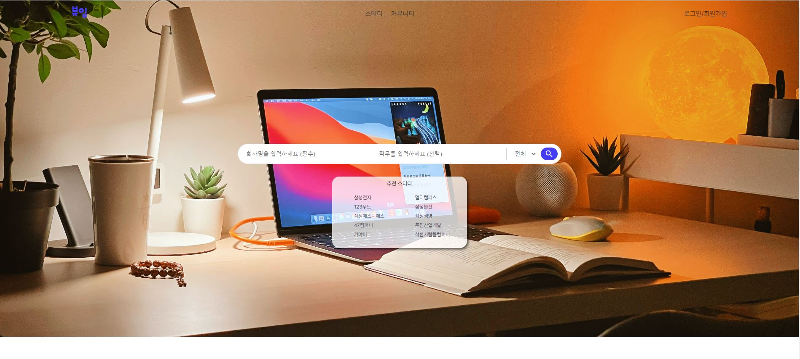

#### 스터디 - 스터디를 검색하고 조회할 수 있는 페이지로 이동합니다.
#### 커뮤니티 - 게시판 페이지로 이동합니다.
#### 로그인/ 회원가입 - 소셜로그인이 가능한 페이지로 이동합니다.

# 로그인화면

#### 뷰잉로고 - 메인페이지로 이동합니다.

#### Kakao로 시작하기 - 카카오 소셜 로그인 페이지로 이동합니다.
#### Google로 시작하기 - 구글 소셜 로그인 페이지로 이동합니다.
#### Github로 시작하기 - 깃허브 소셜 로그인 페이지로 이동합니다.

# 소셜 로그인

## 카카오 로그인

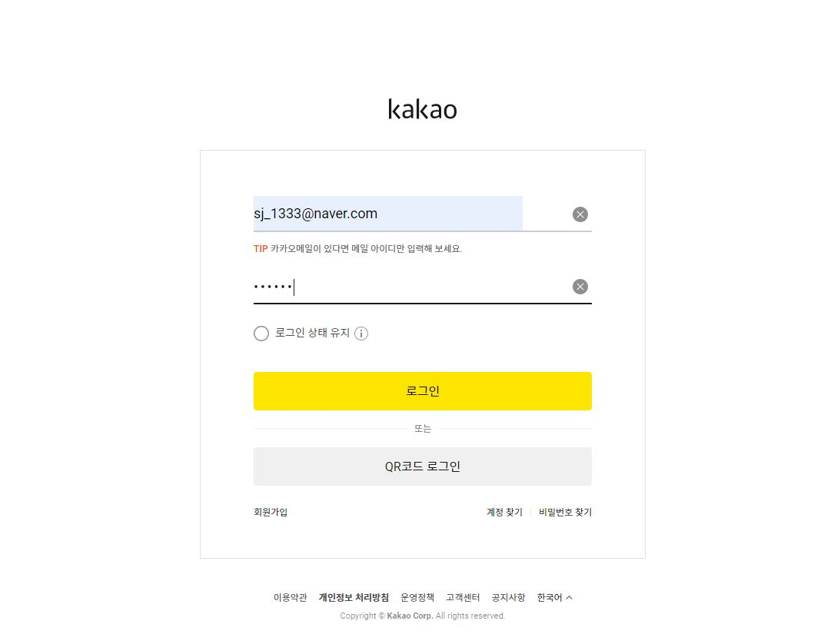
#### 카카오 로그인창 - 로그인을 완료할시에 메인페이지로 리다이렉트합니다.

## 로그인 로딩

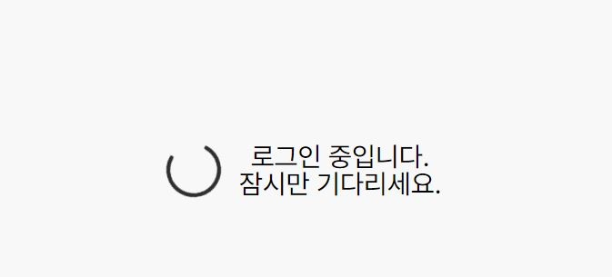

#### 로딩 페이지 - 메인페이지로 리다이렉트 과정에서 로그인 로딩시에 생기는 화면입니다.
# 스터디 검색창

## 추천 스터디 클릭

#### 추천스터디 - 현재 면접스터디에서 인기 있는 회사들의 목록입니다.
#### 회사명 클릭시 해당 회사를 대상으로 한 스터디 검색 결과 페이지 이동합니다.
### 삼성 SDS 클릭시
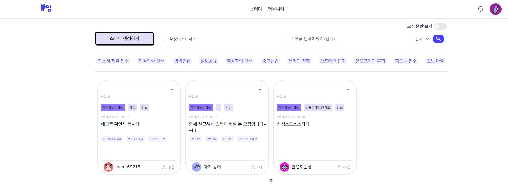
#### 삼성SDS에 해당하는 스터디들이 카드뷰로 보여지게 됩니다.
#### 검색결과에서도 상단에 위치한 검색창에서 회사명을 바꾼후 엔터로도 다른 검색결과로 이동할 수 있습니다.

## 스터디 결과 카드뷰
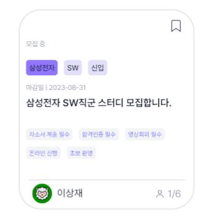
#### 우측 상단의 책갈피 표시를 통해 해당 스터디를 찜 할수 있습니다.
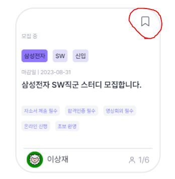
#### 아래에는 회사명, 직무, 경력수준 에 대해 표시됩니다.
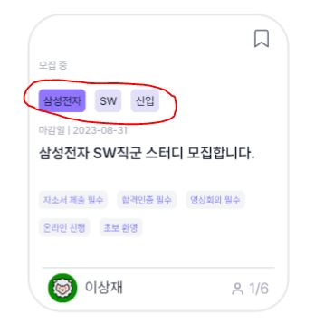
#### 그 아래에는 스터디 제목이 표시됩니다.
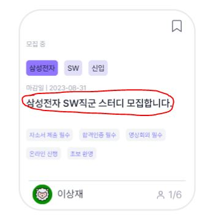
#### 하단에는 스터디에 대한 태그들이 표시됩니다.
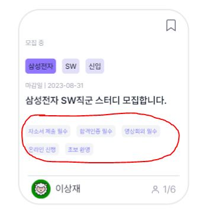
#### 가장 아래에는 스터디장의 간단한 프로필과 현재 스터디원에 대한 정보가 표시됩니다.
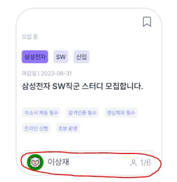
## 검색을 통한 결과
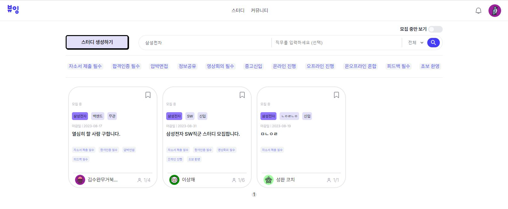
#### 회사명으로 삼성전자를 검색했을때의 결과입니다. 삼성전자에 해당하는 스터디들이 보여지게 됩니다.
#### 상단의 스터디 탭을 클릭해보겠습니다.

## 스터디탭을 통한 화면
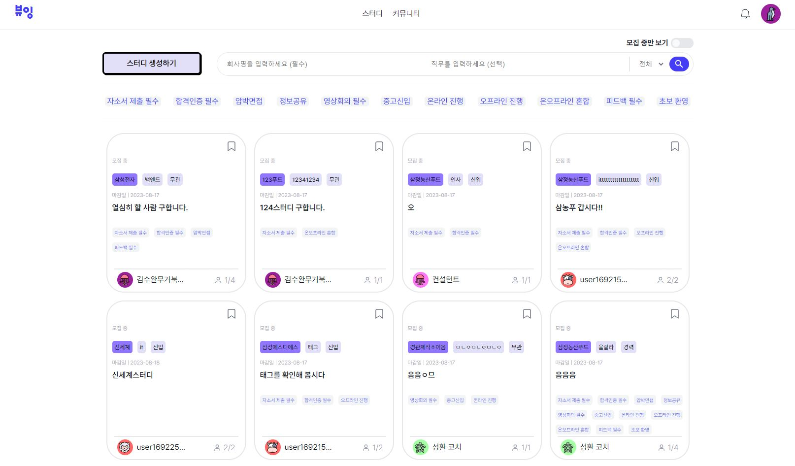

#### 스터디탭을 클릭하면 모든 스터디 결과들을 카드뷰로 최신순으로 페이지네이션하여 보여지게됩니다.

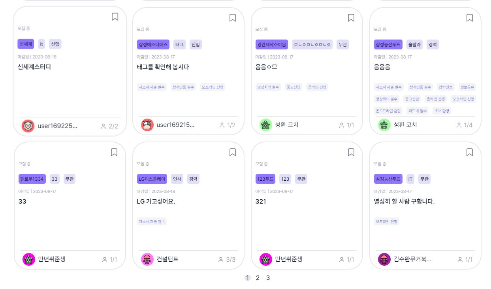
## 스터디 검색탭의 자동완성 드롭박스
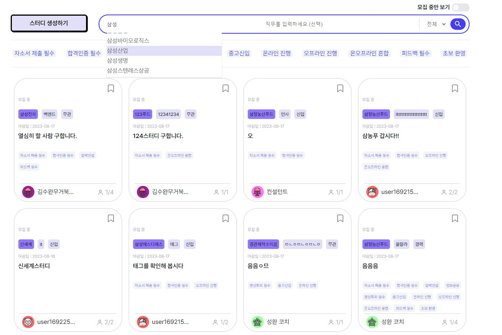
#### 스터디 검색탭에서 회사를 입력할때 회사이름 자동완성을 지원합니다.
#### 회사이름 목록을 방향키를 통해 선택하거나 마우스로 클릭하게 되면 회사이름이 자동완성됩니다.

## 스터디 검색탭의 신입/경력/무관 드롭박스
#### 검색탭에서 경력 수준에 대해 검색 할 수 있습니다.
#### 크게 인턴/신입/경력/전체 가 있습니다.
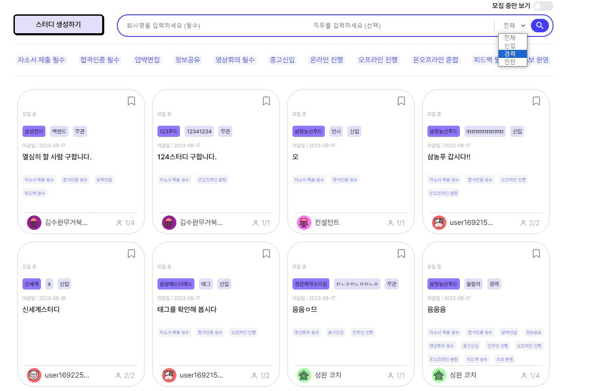
#### 이는 드롭박스를 통해 구현했습니다.
## 직무 비우고 검색 (직무 무관)
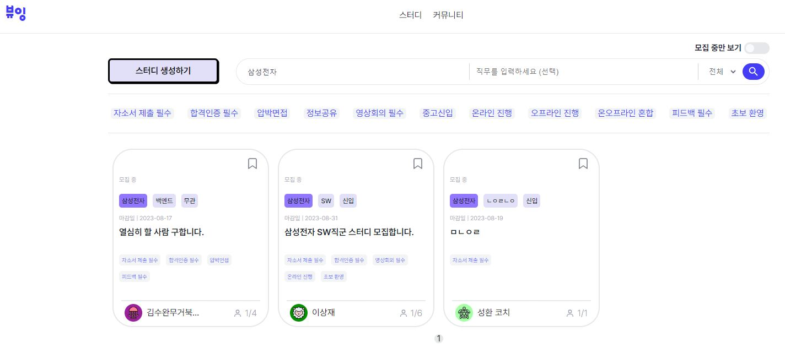
#### 검색조건에서 직무를 입력하지 않으면 직무에 상관없이 스터디를 검색합니다.
## 직무가 포함된 검색
#### 검색조건에 직무가 포함되어 있습니다.
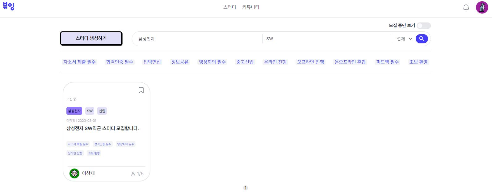
#### 만약 좀 더 구체적인 범위의 면접 스터디를 원하시면 해당 직무에 대한 면접스터디를 검색하실 수 있습니다.

## 태그를 통한 검색

#### 스터디에 해당하는 '태그'를 통해 검색이 가능합니다.
#### 검색탭 아래에 있는 태그들 중 하나를 클릭하시면 됩니다.

## 스터디가 존재하지 않는 경우 스터디 생성
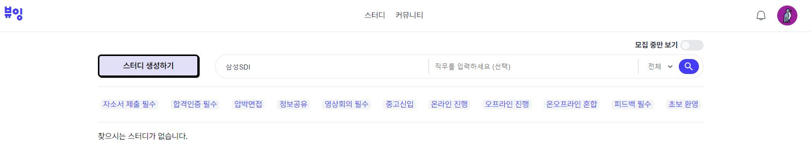
#### 원하는 스터디가 없는 경우 검색탭 왼쪽에 있는 스터디 생성하기를 통해 스터디를 생성 할 수 있습니다.
## 스터디 생성 페이지
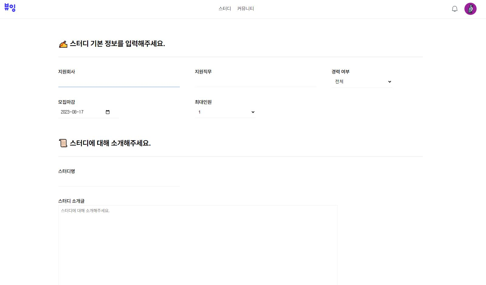
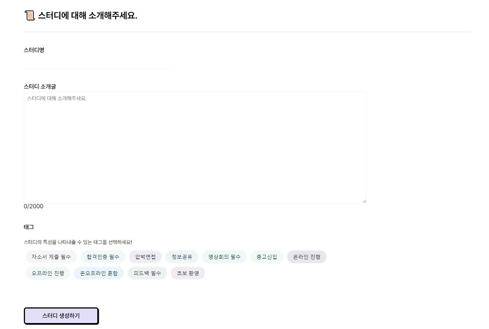
#### 스터디를 생성하기 위해 기본정보들을 입력해야합니다.
#### 지원회사는 검색탭과 마찬가지로 드롭박스 자동완성을 지원합니다.
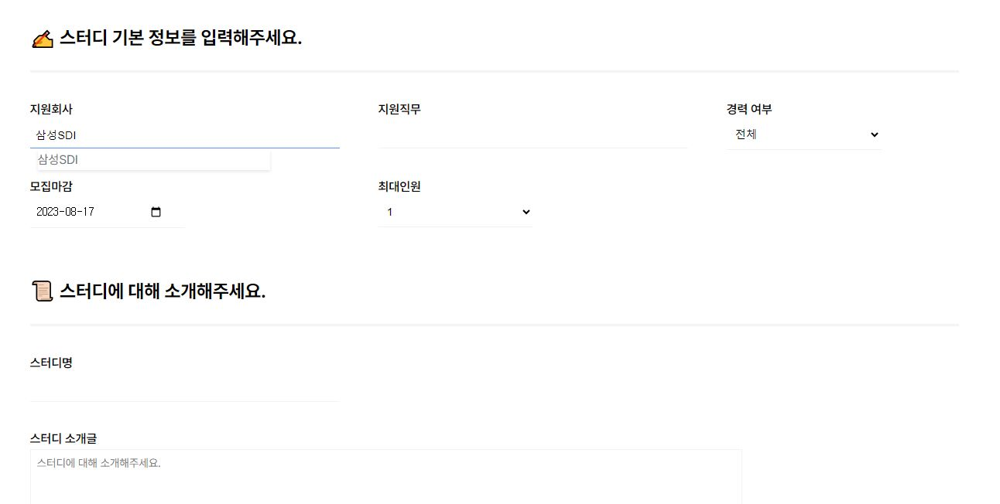
#### 지원 직무를 비워둔다면 직무에 상관없이 모집하는 스터디가 됩니다.
#### 경력수준도 마찬가지로 드롭박스로 선택할 수 있습니다.
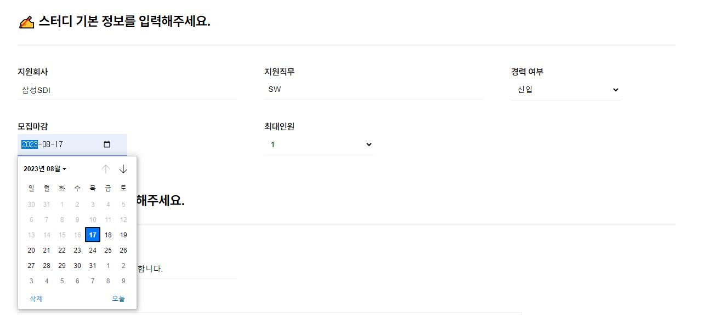
#### 스터디 모집 마감일을 선택할 수 있습니다.
#### 오늘보다 과거 시간은 설정되지 않습니다.
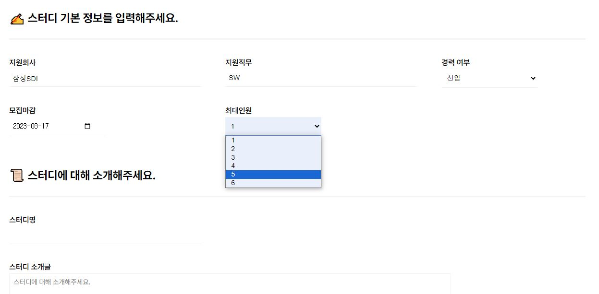
#### 스터디의 최대인원을 설정 할 수 있습니다.

#### 스터디 검색결과에 노출될 스터디명, 스터디 소개글, 그리고 스터디에서 지향하는 '태그'를 선택하여 생성 할 수 있습니다.
#### 위에서 말한 정보들을 입력한후 스터디 생성하기 버튼을 누르면 생성이 완료됩니다.
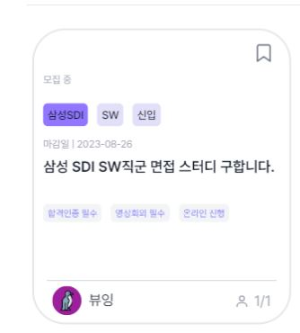
## 다른 스터디 신청

#### 스터디 검색결과에서 가입하지 않은 스터디를 클릭하면 스터디 정보 페이지로 이동합니다.
#### 이 페이지에선 스터디에 대한 상세한 정보와 신청하기 버튼이 있습니다.

#### 신청하기 버튼을 클릭하면 해당 스터디에 신청할 수 있는 창이 생깁니다.
## 이전에 생성한 스터디 페이지

# 스터디